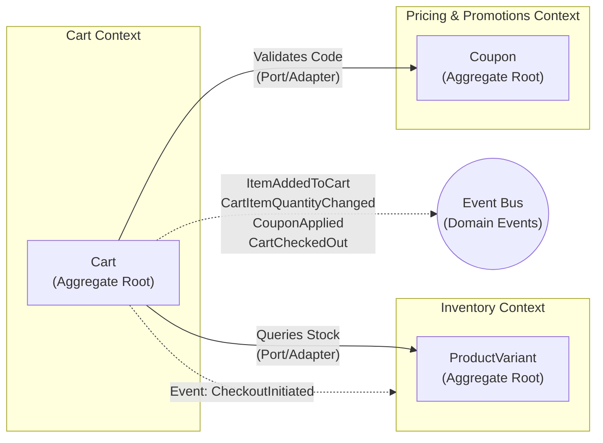

# Shopping Cart Interface Challenge

Welcome to the Shopping Cart Interface challenge! 

In this challenge, you will develop a fully functional and responsive shopping cart interface for a fictional e-commerce platform. You will be provided with designs adapted for mobile, tablet, and desktop interfaces, along with data corresponding to product listings and a sample order.

## Project Brief

As per standard shopping carts, the interface should allow users to add items, modify quantity, remove items, and view an order summary including subtotal, shipping, and total cost. Users should also be able to add a coupon discount code to their order. You will have to dynamically update the user's shopping cart when the user modifies their cart anywhere on the e-commerce platform, and display the same cart contents on the Checkout page when the user clicks the "Checkout" button.

### DDD Architecture & Domain Model

**Technology Stack Note**: This project utilizes **Zustand** as the primary state management library for implementing the UI/Application layer state and repositories.

For the purpose of learning Domain-Driven Design (DDD), this project is divided into three distinct Bounded Contexts. The boundaries, terms, and rules are defined as follows:

1. **🛍️ Cart Context**
   * **Responsibility**: Manages the user's active shopping cart, items, and calculating the raw subtotal.
   * **Aggregate Root**: `Cart` (contains `CartItem` entities uniquely identified by `SkuId`).
   * **Invariants**: Item quantity cannot be less than 1. Can contain multiple coupons.

2. **📦 Inventory Context**
   * **Responsibility**: Manages product variants and available stock levels.
   * **Aggregate Root**: `ProductVariant`.
   * **Invariants**: Cart item quantity cannot exceed available stock.

3. **🎟️ Pricing & Promotions Context**
   * **Responsibility**: Manages coupon codes, validation rules, and calculating order discounts.
   * **Aggregate Root**: `Coupon`.
   * **Invariants**: Validates whether a discount code exists, returning specific domain errors.

*Note: All financial amounts are represented using a `Money` Value Object to avoid floating-point precision issues.*

#### Context Mapping & Domain Events

The contexts remain decoupled by communicating primarily through standard interfaces (Ports) and Domain Events. For instance, the Cart Context queries the Inventory for stock availability, but relies on publishing events (like `CheckoutInitiated`) for the Inventory to asynchronously react and reserve stock.



#### Application Layer (Use Cases) & Ports

The system communicates intent via distinct Application Services (Use Cases). These use cases represent the primary driving adapters.

**Cart Context**
* `AddItemToCartUseCase(cartId, skuId, quantity)`
* `RemoveItemFromCartUseCase(cartId, skuId)`
* `ChangeCartItemQuantityUseCase(cartId, skuId, newQuantity)`
* `ApplyCouponToCartUseCase(cartId, couponCode)`
* `RemoveCouponFromCartUseCase(cartId, couponCode)`
* `InitiateCheckoutUseCase(cartId)`
* **Ports**: `IInventoryService`, `IPricingService` (Driven Adapters connecting out to the other contexts)

**Inventory Context**
* `CheckStockAvailabilityUseCase(skuId, requestedQuantity)` (Synchronous Query)
* `ReserveStockUseCase(orderId, items[])` (Event-Driven)
* `ReleaseStockReservationUseCase(orderId)` (Event/Timer-Driven)
* `ConfirmStockDepletionUseCase(orderId)` (Event-Driven)

**Pricing & Promotions Context**
* `ValidateCouponUseCase(couponCode)`
* `CalculateDiscountUseCase(couponCode, rawSubtotal)`

#### Proposed Folder Structure (Hexagonal)

Following the principles of Hexagonal Architecture, the source code will map driving and driven adapters around a pure domain core:

```text
src/
  features/
    cart/                 <-- 🛍️ Cart Context
      ui/                 <-- [Driving Adapters] React components (CartPage, CartRow)
      application/        <-- [Application] Use Cases & Ports
        use-cases/        (AddItemToCart, ChangeItemQuantity, etc.)
        ports/            (IInventoryService, IPricingService, ICartRepository)
      domain/             <-- [Domain] Pure business rules
        Cart.ts           (Aggregate Root)
        CartItem.ts       (Entity)
        CartEvents.ts
      infrastructure/     <-- [Driven Adapters] Concrete implementations
        adapters/         (InventoryContextAdapter, PricingContextAdapter)
        repositories/     (ZustandCartRepository)

    inventory/            <-- 📦 Inventory Context
      ui/                 <-- [Driving Adapters] Admin components (optional)
      application/        <-- [Application] Use Cases & Ports
        use-cases/        (CheckStockAvailability, ReserveStock, etc.)
        ports/            (IStockRepository)
      domain/             <-- [Domain] Pure business rules
        ProductVariant.ts (Aggregate Root)
      infrastructure/     <-- [Driven Adapters] Concrete implementations
        repositories/     (MockInventoryRepository)

    pricing/              <-- 🎟️ Pricing & Promotions Context
      ui/                 <-- [Driving Adapters] Admin components (optional)
      application/        <-- [Application] Use Cases & Ports
        use-cases/        (ValidateCoupon, CalculateDiscount)
        ports/            (ICouponRepository)
      domain/             <-- [Domain] Pure business rules
        Coupon.ts         (Aggregate Root)
      infrastructure/     <-- [Driven Adapters] Concrete implementations
        repositories/     (MockCouponRepository)
```

### Implementation Requirements

#### General Layout
- **Structure**: The page is divided into two main columns:
  - **Left section**: Cart items
  - **Right section**: Order summary
- **Empty state**: If there are no items in the cart, an empty state should be displayed.

#### Cart Items (Left Column)
- **Default sort**: Latest item added to cart first.
- **Item denomination**: Each product variant added to the cart should be displayed separately (e.g., Orange and Pink variants of the same item appear as separate rows).
- **Item name and image**: Should be clickable and link to the product detail page. Image displayed must correspond to the variant added.
- **Pricing**: If a discount is available, display the list price with a strikethrough next to the sale price. Otherwise, display only the list price.
- **Quantity selector**: "-" and "+" buttons to control quantity.
  - Can only be decreased to 1, after which the user must click "Remove".
  - Can only be increased up to maximum available stock. Disable "+" and show 'Insufficient stock' tooltip when reached.
- **"Remove" link**: A clickable text link. Triggers a confirmation prompt to prevent accidental removals.

#### Order Summary Section
- **Real-time calculation**: Subtotal, shipping (always FREE), and total evaluate automatically and in real-time as quantities or coupons modify.
- **Coupon Code Feature**:
  - Implement "Add coupon code" button states (normal, hover, focus, disabled).
  - Clicking the button turns it into an input field with an "Apply" button.
  - Implement input states (normal, filled, focus, disabled, error, error filled, error focused).
  - Perform validation on "Apply":
    - Empty input -> "Please enter a valid code" error.
    - Invalid code -> "Sorry, but this coupon doesn't exist" error.
    - Valid code -> Success state showing the coupon code as a tag under the field, and the discount amount added under the subtotal.
  - Clicking "x" on applied coupon removes it from the order summary.

#### Stock Validation and Updates
- **Real-time validation**: Validate stock asynchronously when adding a product or modifying quantity. Show an 'Insufficient stock' modal if stock changes, then update cart after the user clicks 'Ok'.
- **Checkout validation**: Validate all cart items' stock availability when clicking "Checkout". Show modal if stock changes, then update cart.
- **[Stretch Goal] Stock reservation**: Reserve stock for a limited time after clicking "Checkout" to prevent concurrency issues where multiple customers attempt to buy the last units.

#### General Requirements
- **Design fidelity**: Match provided designs closely (text color, font size, weight, spacing, dimensions, etc.).
- **Responsive behavior**: Stack vertically on mobile/smaller screens, align horizontally on wider screens.
- **Cross-browser compatibility**: Must work on major browsers including Chrome, Firefox, and Safari.
- **[Stretch Goal] Performance optimization**: Code for fast load times with efficient CSS and JavaScript techniques.
- **[Stretch Goal] Accessibility and semantics**: Follow best practices for web accessibility (semantic HTML, ARIA roles, proper alt tags for images).

## Getting Started

1. Set up your coding environment and GitHub repository.
2. Review the provided `designs` directory to understand the visual requirements for different breakpoints.
3. Develop the solution using your preferred technology stack, applying the functional and visual requirements.
4. Test functionality, responsiveness, cross-browser compatibility, and accuracy.
5. Deploy your work to a hosting platform (e.g., GitHub Pages, Vercel, Netlify).

Good luck, and have fun building the Shopping Cart Interface!
