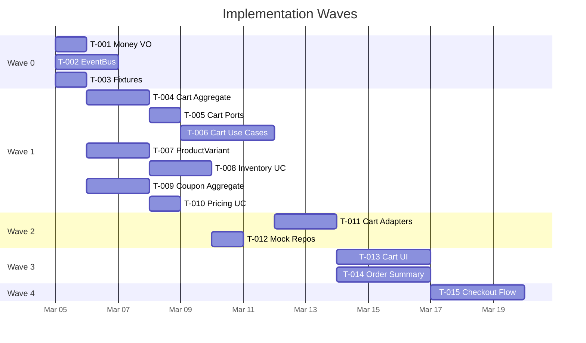

# Implementation Tickets — Shopping Cart Interface

> Tickets are ordered by **wave** (dependency order). A ticket can only start after all its `Depends On` items are complete.

---

## Wave 0 — Foundation

### T-001: Shared `Money` Value Object ✅
| Field | Value |
|---|---|
| **Context** | `shared` |
| **Complexity** | 🟢 Small |
| **Depends On** | — |

**Description**: Implement `src/shared/domain/Money.ts` — an immutable Value Object that wraps financial amounts as integers (cents) to avoid floating-point issues. Must support `add`, `subtract`, `multiply`, `equals`, and `format` (locale-aware currency string).

**Acceptance Criteria**:
- [ ] All arithmetic uses integer cents internally
- [ ] `Money.fromPrice(25)` → stores `2500` cents
- [ ] `money.format()` → `"$25.00"`
- [ ] Immutable — all operations return new `Money` instances
- [ ] Unit tests cover arithmetic, formatting, and edge cases (zero, negative guard)

---

### T-002: Async Domain Event Bus
| Field | Value |
|---|---|
| **Context** | `shared` |
| **Complexity** | 🟡 Medium |
| **Depends On** | — |

**Description**: Implement `src/shared/events/EventBus.ts` — a typed, async Pub/Sub event bus. Handlers subscribe by event type and are invoked asynchronously when events are published. Must support multiple handlers per event and provide an `unsubscribe` mechanism.

**Acceptance Criteria**:
- [ ] `eventBus.subscribe<ItemAddedToCart>(handler)` registers a typed handler
- [ ] `eventBus.publish(event)` invokes all matching handlers asynchronously
- [ ] Multiple handlers per event type supported
- [ ] `unsubscribe` returns a teardown function
- [ ] Unit tests cover: subscribe, multi-handler dispatch, unsubscribe, async execution order

---

### T-003: Shared Fixtures from `data/`
| Field | Value |
|---|---|
| **Context** | `shared` |
| **Complexity** | 🟢 Small |
| **Depends On** | — |

**Description**: Create `src/shared/fixtures/` by importing and re-exporting typed data from the existing `data/` folder (`products.json`, `inventory.json`, `coupons.json`, `sample-cart.json`, `product-images.json`). Provide TypeScript types for each JSON shape.

**Acceptance Criteria**:
- [ ] Each JSON file has a corresponding TypeScript interface (e.g., `InventoryRecord`, `CouponRecord`)
- [ ] Data is importable via `import { inventoryData } from '@/shared/fixtures'`
- [ ] Types match the actual JSON shape (validated by TS compiler, no `any`)

---

## Wave 1 — Domain Models & Ports

### T-004: Cart Aggregate Root & `CartItem` Entity
| Field | Value |
|---|---|
| **Context** | 🛍️ Cart |
| **Complexity** | 🟡 Medium |
| **Depends On** | T-001 |

**Description**: Implement `Cart.ts` (Aggregate Root) and `CartItem.ts` (Entity). The Cart manages an internal collection of `CartItem`s keyed by `skuId`. Enforce invariants: quantity ≥ 1, multiple coupons allowed. Cart has lifecycle states: `Active` → `Checkout_Pending` → `Checked_Out`. Subtotal is computed from `CartItem` prices using `Money`.

**Acceptance Criteria**:
- [ ] `cart.addItem(item)` adds or increments quantity
- [ ] `cart.removeItem(skuId)` removes an item
- [ ] `cart.changeQuantity(skuId, qty)` enforces qty ≥ 1
- [ ] `cart.subtotal` returns a `Money` value
- [ ] State transitions: `initiateCheckout()` → `Checkout_Pending`, `markCheckedOut()` → `Checked_Out`
- [ ] Domain events emitted: `ItemAddedToCart`, `CartItemQuantityChanged`, `ItemRemovedFromCart`, `CartCleared`
- [ ] Unit tests for all invariants and state transitions

---

### T-005: Cart Ports (Interfaces)
| Field | Value |
|---|---|
| **Context** | 🛍️ Cart |
| **Complexity** | 🟢 Small |
| **Depends On** | T-004 |

**Description**: Define port interfaces in `src/features/cart/application/ports/`: `ICartRepository`, `IInventoryService`, `IPricingService`. These are the contracts that driven adapters must fulfill.

**Acceptance Criteria**:
- [ ] `ICartRepository`: `getCart()`, `saveCart(cart)` method signatures
- [ ] `IInventoryService`: `checkStockAvailability(skuId, quantity): Promise<StockResult>`
- [ ] `IPricingService`: `validateCoupon(code): Promise<CouponResult>`, `calculateDiscount(code, subtotal): Promise<Money>`
- [ ] All return types are domain types (no infrastructure leaks)

---

### T-006: Cart Use Cases
| Field | Value |
|---|---|
| **Context** | 🛍️ Cart |
| **Complexity** | 🔴 Large |
| **Depends On** | T-004, T-005, T-002 |

**Description**: Implement all Cart use cases in `src/features/cart/application/use-cases/`: `AddItemToCart`, `RemoveItemFromCart`, `ChangeCartItemQuantity`, `ApplyCouponToCart`, `RemoveCouponFromCart`, `InitiateCheckout`. Each use case orchestrates domain logic, validates via driven ports, and publishes domain events.

**Acceptance Criteria**:
- [ ] `AddItemToCart` checks stock via `IInventoryService` before adding
- [ ] `ChangeCartItemQuantity` checks stock before updating
- [ ] `ApplyCouponToCart` validates via `IPricingService`
- [ ] `InitiateCheckout` validates all items' stock, transitions state, emits `CheckoutInitiated`
- [ ] All use cases publish appropriate domain events via EventBus
- [ ] Unit tests with mocked ports for each use case (happy + error paths)

---

### T-007: `ProductVariant` Aggregate Root
| Field | Value |
|---|---|
| **Context** | 📦 Inventory |
| **Complexity** | 🟡 Medium |
| **Depends On** | T-001 |

**Description**: Implement `ProductVariant.ts` and `StockReservation.ts` (Value Object). `ProductVariant` holds `totalOnHand`, `sold`, pricing info, and a collection of `StockReservation`s. Available stock = `totalOnHand - sumReserved`. Enforce `totalOnHand ≥ 0`.

**Acceptance Criteria**:
- [ ] `variant.availableStock` computes correctly
- [ ] `variant.reserve(orderId, qty)` creates a `StockReservation`
- [ ] `variant.releaseReservation(orderId)` removes it
- [ ] `variant.confirmDepletion(orderId)` reduces `totalOnHand` and removes reservation
- [ ] Domain events: `StockReserved`, `StockDepleted`
- [ ] Unit tests for stock math and reservation lifecycle

---

### T-008: Inventory Ports & Use Cases
| Field | Value |
|---|---|
| **Context** | 📦 Inventory |
| **Complexity** | 🟡 Medium |
| **Depends On** | T-007 |

**Description**: Define `IStockRepository` port and implement use cases: `CheckStockAvailability`, `ReserveStock`, `ReleaseStockReservation`, `ConfirmStockDepletion`.

**Acceptance Criteria**:
- [ ] `CheckStockAvailability(skuId, qty)` returns `{ available: boolean, currentStock: number }`
- [ ] `ReserveStock` creates reservations and emits `StockReserved`
- [ ] `ReleaseStockReservation` cleans up expired holds
- [ ] Unit tests with mocked repository

---

### T-009: `Coupon` Aggregate Root
| Field | Value |
|---|---|
| **Context** | 🎟️ Pricing |
| **Complexity** | 🟡 Medium |
| **Depends On** | T-001 |

**Description**: Implement `Coupon.ts` aggregate. Coupons have a `code`, optional `discount_amount` (flat `Money`), and optional `discount_percentage`. Supports two discount modes: flat amount or percentage. Calculating discount against a subtotal must never result in negative totals.

**Acceptance Criteria**:
- [ ] `coupon.calculateDiscount(subtotal: Money): Money` works for flat and percentage modes
- [ ] Percentage mode: `$100 subtotal × 10% → $10 discount`
- [ ] Flat mode: `$5 off`
- [ ] 100% discount caps at subtotal (total ≥ $0.00)
- [ ] Domain events: `CouponValidated`, `CouponValidationFailed`, `DiscountCalculated`
- [ ] Unit tests for both modes + edge cases

---

### T-010: Pricing Ports & Use Cases
| Field | Value |
|---|---|
| **Context** | 🎟️ Pricing |
| **Complexity** | 🟢 Small |
| **Depends On** | T-009 |

**Description**: Define `ICouponRepository` port. Implement `ValidateCoupon` and `CalculateDiscount` use cases.

**Acceptance Criteria**:
- [ ] `ValidateCoupon(code)` returns success or specific domain error (`"Please enter a valid code"`, `"Sorry, but this coupon doesn't exist"`)
- [ ] `CalculateDiscount(code, subtotal)` returns the discount `Money`
- [ ] Unit tests with mock repo

---

## Wave 2 — Infrastructure (Driven Adapters)

### T-011: Zustand Cart Repository + Context Adapters
| Field | Value |
|---|---|
| **Context** | 🛍️ Cart |
| **Complexity** | 🟡 Medium |
| **Depends On** | T-005, T-008, T-010 |

**Description**: Implement `ZustandCartRepository` (implements `ICartRepository`), `InventoryContextAdapter` (implements `IInventoryService` by calling Inventory use cases), and `PricingContextAdapter` (implements `IPricingService` by calling Pricing use cases). Wire everything so the Cart context can query stock and coupons through its ports.

**Acceptance Criteria**:
- [ ] `ZustandCartRepository.getCart()` returns reactive Cart state
- [ ] `InventoryContextAdapter.checkStockAvailability()` delegates to Inventory use case
- [ ] `PricingContextAdapter.validateCoupon()` delegates to Pricing use case
- [ ] Integration tests verifying the full port → adapter → use case chain

---

### T-012: Mock Inventory & Coupon Repositories
| Field | Value |
|---|---|
| **Context** | 📦 Inventory + 🎟️ Pricing |
| **Complexity** | 🟢 Small |
| **Depends On** | T-003, T-008, T-010 |

**Description**: Implement `MockInventoryRepository` (loads from `shared/fixtures/inventory`) and `MockCouponRepository` (loads from `shared/fixtures/coupons`). These are the in-memory driven adapters that will later be swapped for real API calls.

**Acceptance Criteria**:
- [ ] Repositories load data from shared fixtures at initialization
- [ ] `MockInventoryRepository.findBySku(skuId)` returns a `ProductVariant`
- [ ] `MockCouponRepository.findByCode(code)` returns a `Coupon` or `null`
- [ ] Designed behind the port interface — swapping to `AxiosInventoryRepository` later requires zero domain changes

---

## Wave 3 — UI Components

### T-013: Cart Page & Cart Row Components
| Field | Value |
|---|---|
| **Context** | 🛍️ Cart UI |
| **Complexity** | 🔴 Large |
| **Depends On** | T-006, T-011 |

**Description**: Build `CartPage`, `CartRow`, `EmptyState`, and `QuantitySelector` React components. Cart renders items sorted by `created_at` (latest first). Each row shows variant image, name, pricing (strikethrough list price if discounted), quantity selector, and remove link. Responsive: two-column on desktop, stacked on mobile.

**Acceptance Criteria**:
- [ ] Empty cart → `EmptyState` component rendered
- [ ] Cart items sorted latest-first by `created_at`
- [ ] Variant image + name are clickable (link to product detail)
- [ ] Discount pricing: sale price shown, list price struck through
- [ ] `QuantitySelector`: "−" disabled at qty=1, "+" disabled at max stock with tooltip
- [ ] "Remove" link triggers confirmation prompt
- [ ] Responsive layout: columns on desktop, stacked on mobile
- [ ] Component tests for each state

---

### T-014: Order Summary & Coupon Input Components
| Field | Value |
|---|---|
| **Context** | 🛍️ Cart UI |
| **Complexity** | 🔴 Large |
| **Depends On** | T-006, T-011 |

**Description**: Build `OrderSummary` and `CouponInput` components. Order summary shows subtotal, applied discounts, shipping (FREE), and total — all recalculating in real time. Coupon input has button → input transition, Apply button, validation states (empty error, invalid error, success tag), and remove ("x") on applied coupons.

**Acceptance Criteria**:
- [ ] Subtotal, shipping, total update in real time on every cart mutation
- [ ] "Add coupon code" button transitions to input field on click
- [ ] Input states: normal, filled, focus, disabled, error, error-filled, error-focused
- [ ] Empty submit → "Please enter a valid code" error
- [ ] Invalid code → "Sorry, but this coupon doesn't exist" error
- [ ] Valid code → success tag shown, discount line added to summary
- [ ] "x" on tag removes coupon and recalculates
- [ ] Component tests for all states and interactions

---

## Wave 4 — Integration & Checkout

### T-015: Checkout Flow & Stock Reservation
| Field | Value |
|---|---|
| **Context** | Cross-context |
| **Complexity** | 🔴 Large |
| **Depends On** | T-006, T-008, T-011, T-013, T-014 |

**Description**: Wire the end-to-end checkout flow. "Checkout" button triggers `InitiateCheckoutUseCase` which validates all items' stock, emits `CheckoutInitiated`, and Inventory subscribes to reserve stock. If stock has changed since cart was loaded, show modal with updated quantities and let user confirm. Includes stock reservation with timeout (stretch).

**Acceptance Criteria**:
- [ ] Clicking "Checkout" validates all cart items' stock availability
- [ ] If stock changed → modal shown with updated info, cart updated on "Ok"
- [ ] `CheckoutInitiated` event triggers `ReserveStock` in Inventory context (via EventBus)
- [ ] Reserved stock reduces available count for other users
- [ ] Reservation timeout releases stock (stretch: timer-driven `ReleaseStockReservation`)
- [ ] Cart transitions to `Checked_Out` state on success
- [ ] Integration test covering the full event chain

---

## Summary Matrix

| Wave | Tickets | Effort |
|---|---|---|
| **0 — Foundation** | T-001, T-002, T-003 | 🟢🟢🟡 |
| **1 — Domain & Ports** | T-004 → T-010 | 🟡🟢🔴🟡🟡🟡🟢 |
| **2 — Infrastructure** | T-011, T-012 | 🟡🟢 |
| **3 — UI** | T-013, T-014 | 🔴🔴 |
| **4 — Integration** | T-015 | 🔴 |
| **Total** | **15 tickets** | |

