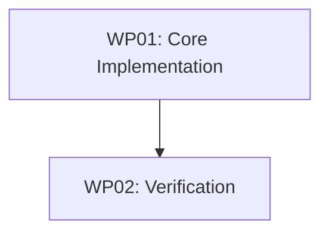

# Tasks: Async Domain Event Bus

> Tasks are structured to enable clean, decoupled communication across bounded contexts.

---

## Phase 0: Foundation Setup

### WP01: Event Bus Core Implementation
**Goal**: Implement the foundational structures, interfaces, and the core `EventBus` class.
**Priority**: 🔴 Essential
**Depends On**: —
**Estimated Size**: ~450 lines

- [ ] **T001**: Define `DomainEvent` and `EventHandler` types. `[P]`
- [ ] **T002**: Define `IEventBus` interface. `[P]`
- [ ] **T003**: Implement `EventBus` class (registry and state management).
- [ ] **T004**: Implement `subscribe` and `unsubscribe` logic.
- [ ] **T005**: Implement async `publish` with error isolation (`Promise.allSettled`).
- [ ] **T006**: Export `eventBus` singleton instance.

**Implementation Sketch**:
1. Create `DomainEvent.ts` with basic event shape (`eventName`, `timestamp`, `payload`).
2. Define `IEventBus` interface in separate file for port access.
3. Build the `EventBus` class using a `Map<string, Array<EventHandler>>`.
4. Implement `subscribe` to return an anonymous teardown function.
5. Use `Promise.allSettled` in `publish` to ensure one failure doesn't block other handlers.

---

## Phase 1: Verification

### WP02: Event Bus Verification
**Goal**: Ensure the Event Bus behaves as specified, especially regarding async execution and error isolation.
**Priority**: 🟡 Important
**Depends On**: WP01
**Estimated Size**: ~300 lines

- [ ] **T007**: Implement comprehensive Vitest suite covering happy and edge cases.

**Implementation Sketch**:
1. Test single and multiple subscribers.
2. Verify `unsubscribe` works as expected.
3. Test that handlers are executed asynchronously.
4. Test error isolation: if one handler throws, others must still run.
5. Verify no memory leaks (subscribers removed).

---

## Technical Context Summary

| Item | Value |
|---|---|
| **Tech Stack** | TypeScript, Vitest |
| **Location** | `src/shared/events/` |
| **Patterns** | Pub/Sub, Singleton, Error Isolation |

---

## Work Package Dependency Graph

